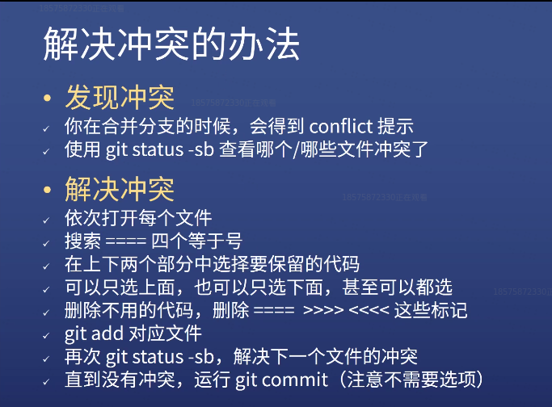

# 学习git命令行
## git命令（本地）
用git前要配置好
```git
git config --global user.name 你的英文名
git config --global user.email 你的邮箱
git config --global push.default simple
git config --global core.quotepath false
git config --global core.editor "code --wait"
git config --global core.autocrlf input
```
注意：上面的英文名和邮箱跟 GitHub 没有关系。  
上面的设置是默认vscode，你自己也可以设置与git相关的软件
`git config --global --list 查看配置如何`

`Git init `  创建名叫.git本地仓库（注意要看当前路径，不然设错路径文件很大）  
`Git add 文件名`  (或者当前路径’ . ’) 添加准备commit的状态  
`Git status`  顾名思义看状态  


`Git commit –m `字符串（提交的理由）  
`Git commit –v`详细看修改哪些地方，然后在第一行家提交理由
打开vscode（自己之前设置打开的软件，可选的）

`Git log `查看当前.git仓库之前的版本

`Git reset --hard xxx `回退到xxx版本（之前commit过有记录版本号用git log）

`Git reflog `查看全部的版本号可以查看所有分支的所有操作记录（包括已经被删除的 commit 记录和 reset 的操作）

`Git branch `分支名 创建分支         
`Git branch –d `分支名 删除分支  
`Git checkout `分支名 切换分支

`Git merge xxx `将xxx分支合并到当前分支(很多时候回发生冲突)
>这里引用一下饥人谷的图片  
